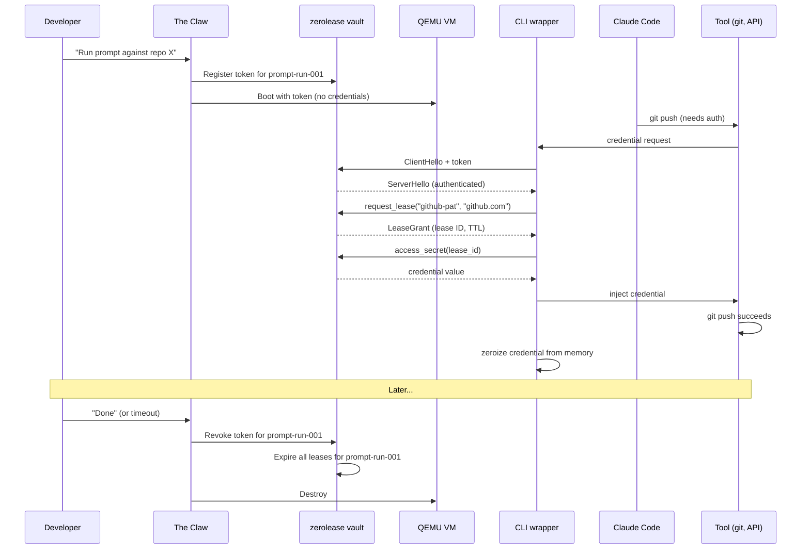

# Deployment Architecture: Cloud Agent Stacks

This document describes how zerolease fits into a production deployment where AI coding agents run inside isolated QEMU virtual machines, managed by an orchestrator (the Claw).

## The Problem

You want to run Claude Code agents that need real credentials — GitHub tokens, API keys, database passwords — inside disposable cloud VMs. The agents shouldn't hold raw credentials. They shouldn't be able to exfiltrate them. And when the work is done, every credential should be revocable in one shot.

## Overview

```
┌─────────────────────────────────────────────────────────────────┐
│  AWS Instance                                                   │
│                                                                 │
│  ┌──────────────────────────────────────┐                       │
│  │  The Claw (orchestrator)             │                       │
│  │                                      │                       │
│  │  ┌────────────┐  ┌────────────────┐  │                       │
│  │  │ zerolease  │  │ Token Manager  │  │                       │
│  │  │ vault      │  │ (per prompt    │  │                       │
│  │  │            │  │  run)          │  │                       │
│  │  └─────┬──────┘  └───────┬────────┘  │                       │
│  │        │ TCP :9100       │           │                       │
│  │        │ (localhost)     │           │                       │
│  └────────┼─────────────────┼───────────┘                       │
│           │                 │                                   │
│     ┌─────┴─────────────────┴──────────────────┐                │
│     │  QEMU host-forwarded ports               │                │
│     └─────┬──────────────┬──────────────┬──────┘                │
│           │              │              │                       │
│  ┌────────┴───────┐ ┌───┴────────┐ ┌───┴────────┐              │
│  │  QEMU VM       │ │  QEMU VM   │ │  QEMU VM   │              │
│  │  Stack A       │ │  Stack B   │ │  Stack C   │              │
│  │                │ │            │ │            │              │
│  │  prompt-run-   │ │  prompt-   │ │  prompt-   │              │
│  │  001           │ │  run-002   │ │  run-003   │              │
│  │                │ │            │ │            │              │
│  │  ┌───────────┐ │ │  ┌──────┐  │ │  ┌──────┐  │              │
│  │  │ CLI       │ │ │  │ CLI  │  │ │  │ CLI  │  │              │
│  │  │ wrapper   │ │ │  │ wrap │  │ │  │ wrap │  │              │
│  │  │     │     │ │ │  │  │   │  │ │  │  │   │  │              │
│  │  │  Claude   │ │ │  │  CC  │  │ │  │  CC  │  │              │
│  │  │  Code     │ │ │  │      │  │ │  │      │  │              │
│  │  └───────────┘ │ │  └──────┘  │ │  └──────┘  │              │
│  │  postgres, etc │ │  dev env   │ │  dev env   │              │
│  └────────────────┘ └────────────┘ └────────────┘              │
│                                                                 │
└─────────────────────────────────────────────────────────────────┘
```

## How It Works

### 1. A developer requests a prompt run

Someone asks the Claw to run a Claude Code agent against a repository. The Claw knows who is asking and what credentials they're authorized to use.

### 2. The Claw provisions a token

Before spinning up VMs, the Claw registers a **prompt-run token** with the zerolease vault. This token is scoped to a specific set of credentials and has a TTL matching the expected run duration.

```
Claw → zerolease vault: register token "prompt-run-001"
  → grants access to: github-pat, jira-token
  → domains: github.com, *.atlassian.net
  → TTL: 2 hours
  → role: Agent (bound to agent ID "prompt-run-001")
```

### 3. The Claw boots the VM stack

A QEMU VM is started with:
- A pre-baked development environment (language runtimes, database, etc.)
- The prompt-run token injected at boot (via cloud-init or QEMU `-fw_cfg`)
- Network configured so the VM can reach the host vault via a forwarded port

The VM doesn't receive any real credentials at boot. It only has the token.

### 4. The CLI wrapper exchanges leases for credentials

Inside the VM, Claude Code is wrapped by a thin CLI that intercepts credential requests. When a tool needs a GitHub token:

```
Claude Code → CLI wrapper: "I need the GitHub token"
CLI wrapper → zerolease vault (TCP, with prompt-run token):
    1. ClientHello with token → authenticated as prompt-run-001
    2. request_lease(secret: "github-pat", domain: "github.com")
    3. access_secret(lease_id) → receives actual token
CLI wrapper → Claude Code: injects credential into tool environment
```

The real credential exists in the VM's memory only for the duration of the tool call. The `LeaseGuard` zeroizes it on drop.

### 5. When the prompt run ends

The Claw revokes the prompt-run token. All leases issued under that token expire immediately. The VM is destroyed. No credentials persist anywhere.

## Credential Flow



## Security Properties

**Credentials never leave the host.** The vault runs on the same AWS instance as the QEMU VMs. TCP traffic stays on localhost. No credential material crosses a network boundary.

**Agents can't exfiltrate.** A leaked lease ID is useless — it's bound to a specific domain. A GitHub lease can't be used against `evil.com`. The vault checks the target domain on every `access_secret` call.

**Time-bounded by default.** Leases expire. If the Claw crashes, credentials become inaccessible after the TTL. No dangling access.

**One revocation kills everything.** Revoking the prompt-run token invalidates all leases issued under it. The Claw doesn't need to track individual credentials — it tracks prompt runs.

**Auditable.** Every lease grant, access, and revocation is logged with the prompt-run ID, agent identity, target domain, and timestamp. The Claw can answer "what credentials did prompt-run-001 use?" from the audit log.

## What Lives Where

| Component | Runs on | Provided by |
|-----------|---------|-------------|
| zerolease vault | Host (AWS instance) | zerolease core + store crate |
| Token management | Host | The Claw (implements `Authenticator`) |
| TCP listener | Host, port 9100 | zerolease `TcpListener` |
| CLI wrapper | Guest (QEMU VM) | Custom binary using `zerolease-provider` |
| Claude Code | Guest (QEMU VM) | Anthropic |
| Dev environment | Guest (QEMU VM) | Pre-baked VM image |

## Open Questions

- **Token delivery mechanism.** Cloud-init userdata vs. QEMU `-fw_cfg` vs. virtio-serial. Cloud-init is simplest but the token is visible to anything in the VM that can read the metadata service.
- **Connection pooling.** Currently each credential request opens a new TCP connection. For high-frequency tool use, a persistent connection or connection pool in the CLI wrapper would reduce latency.
- **Multi-instance coordination.** When prompt-run stacks span multiple AWS instances (not planned initially), the vault would need to be network-accessible or replicated. TLS becomes mandatory at that point.
